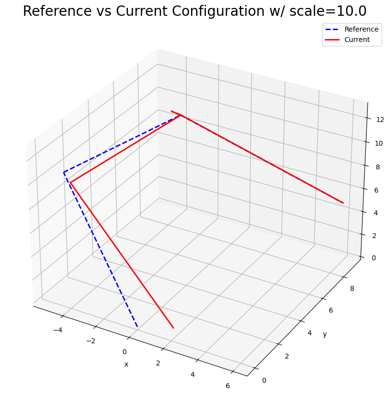
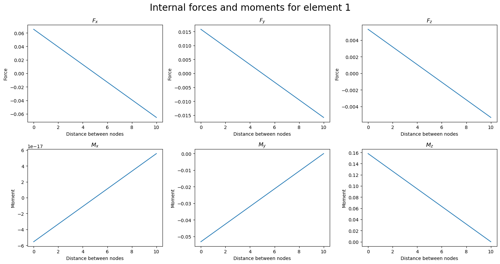
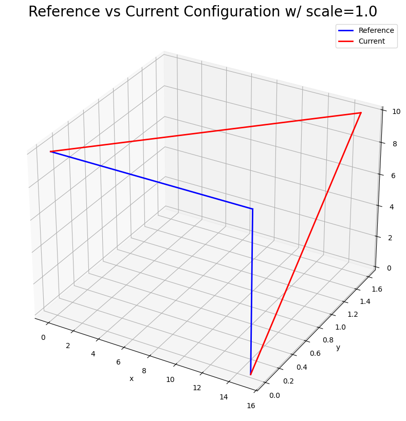
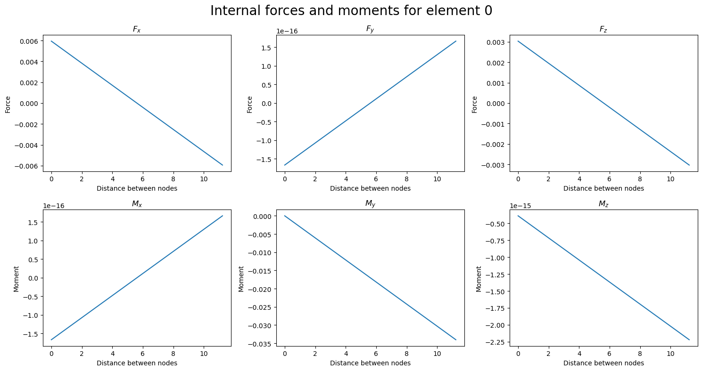
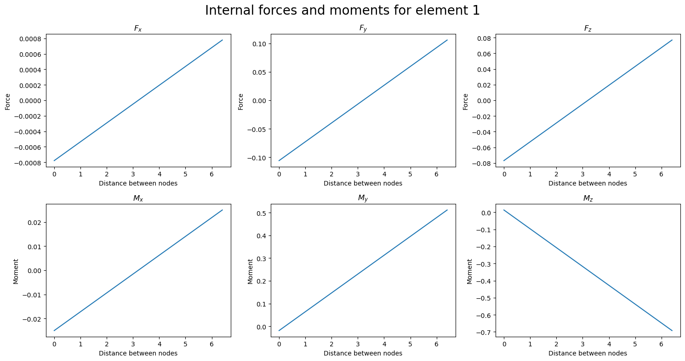
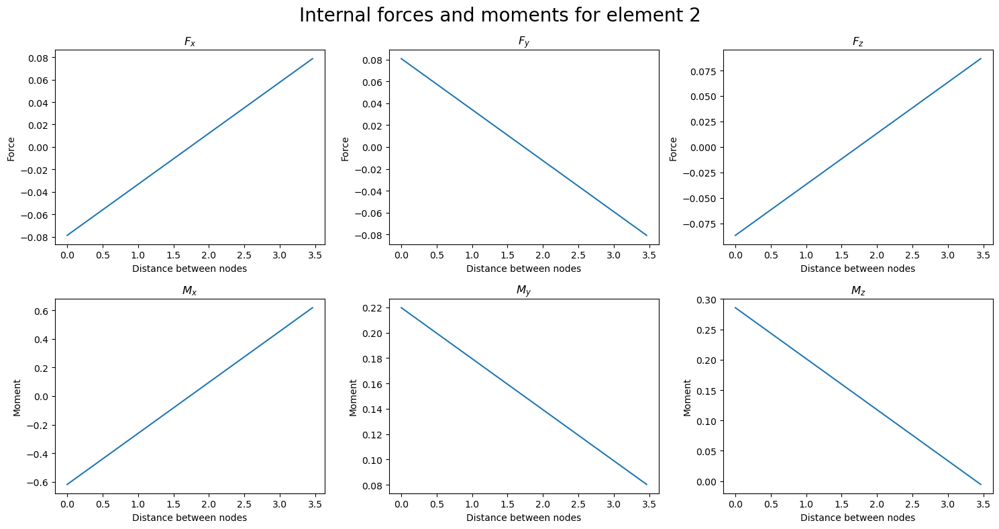
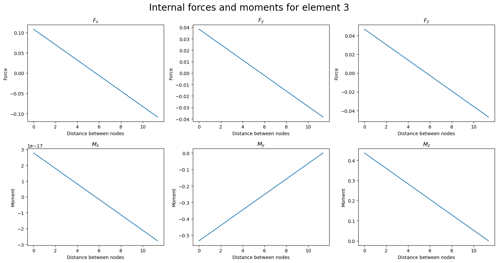
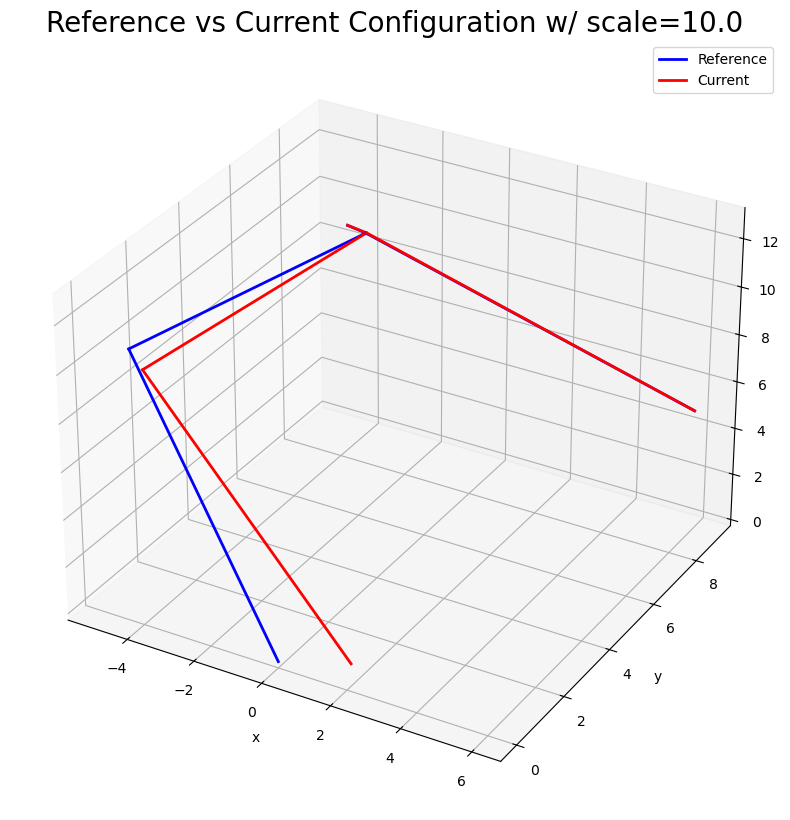

# Assignment 2

[](https://www.python.org/)

[](https://github.com/sandialabs/sibl#license)

[](https://codecov.io/gh/quan4444/me700_assignment2)
[](https://github.com/quan4444/me700_assignment2/actions)

## Table of Contents

* [Direct Stiffness Method](#dsm)
* [Installation Instructions](#install)
* [Examples in Class](#inclass)
* [Elastic Critical Load Analysis](#critical)
* [Template to Run Code](#template1)


## Direct Stiffness Method <a name="dsm"></a>

In structural engineering, the direct stiffness method, also known as the matrix stiffness method, is a structural analysis technique particularly suited for computer-automated analysis of complex structures including the statically indeterminate type [1]. It is a matrix method that makes use of the members' stiffness relations for computing member forces and displacements in structures. The direct stiffness method is the most common implementation of the finite element method (FEM). In applying the method, the system must be modeled as a set of simpler, idealized elements interconnected at the nodes. The material stiffness properties of these elements are then, through linear algebra, compiled into a single matrix equation which governs the behaviour of the entire idealized structure. The structure’s unknown displacements and forces can then be determined by solving this equation. The direct stiffness method forms the basis for most commercial and free source finite element software. 

[1] https://en.wikipedia.org/wiki/Direct_stiffness_method

## Installation Instructions <a name="install"></a>

To install this package, please begin by setting up a conda environment:
```bash
mamba create --name assignment2 python=3.9.12
```
Once the environment has been created, activate it:

```bash
mamba activate assignment2
```
Double check that python is version 3.9.12 in the environment:
```bash
python --version
```
Ensure that pip is using the most up to date version of setuptools:
```bash
pip install --upgrade pip setuptools wheel
```
Create an editable install of the direct stiffness method code (note: you must be in the same directory as the .toml file):
```bash
python -m pip install -e .
```

OPTIONAL for debugging: If any package is missing, you can simply run the installation command for that package. For example, if pytest is missing, please run:
```bash
mamba install pytest
```

Test that the code is working with pytest:
```bash
pytest -v --cov=a2 --cov-report term-missing
```

If you are using VSCode to run this code, don't forget to set VSCode virtual environment to assignment2 environment.

To run the tutorials notebook, ``run_direct_stiffness_method.ipynb`` (located inside the ``tutorials`` folder), you can install notebook as follow:
```bash
mamba install jupyter notebook -y
```
To run the notebook in VSCode, simply double click on the ``run_direct_stiffness_method.ipynb`` file. If you're on a terminal on a desktop, you can run the notebook with:
```bash
jupyter notebook run_direct_stiffness_method.ipynb
```
_Note: Depending on your IDE, you might be prompted to install some extra dependencies. In VSCode, this should be a simple button click._

## In class examples <a name="inclass"></a>

### Example 1


```python
import numpy as np
from a2 import direct_stiffness_method as dsm

# Define nodes and elements
nodes = np.array([[0, 0, 10], [15, 0, 10],[15,0,0]])
elements = np.array([[0, 1],[1,2]])

# Define subdomains and material properties
b,h=0.5,1.0
E=1000
nu=0.3
A=b*h
Iy=h*(b**3)/12
Iz=b*(h**3)/12
Ip=b*h/12*(b**2+h**2)
J=0.02861
E0_local_z=[0,0,1]
E1_local_z=[1,0,0]
subdomain_dict = {1:[E,nu,A,Iz,Iy,Ip,J,E0_local_z],
                  2:[E,nu,A,Iz,Iy,Ip,J,E1_local_z]}
subdomain_elements = {1:[0],2:[1]}

# Define supports and loads
supports = {0: (0, 0, 0, 0, 0, 0), # Fixed support at node 0
            2: (0, 0, 0, None, None, None)}  # Pinned support at node 0
loads = {1:[0.1,0.05,-0.07,0.05,-0.1,0.25]}  # Load at node 1

# Initialize classes
mesh = dsm.Mesh(nodes, elements)
materials = dsm.MaterialParams(subdomain_dict)
for subdomain_id, elements_in_sub in subdomain_elements.items():
    materials.assign_subdomain(subdomain_id, elements_in_sub)

bcs = dsm.BoundaryConditions(supports)
bcs.add_load(loads)

# Solve the system
solver = dsm.Solver(mesh, materials, bcs)
displacements, reactions = solver.generate_mesh_and_solve()
```

    node 0 disp: [u:0.0, v:0.0, w:0.0, theta_x:0.0, theta_y:0.0, theta_z:0.0]
    node 0 rxn: [Fx:-0.09468, Fy:-0.0342, Fz:0.0047, Mx:0.10799, My:-0.0236, Mz:-0.76302]
    ------------------------------------------------------------------
    node 1 disp: [u:0.00284, v:1.59843, w:-0.00131, theta_x:-0.1472, theta_y:-0.01673, theta_z:0.18234]
    node 1 rxn: [Fx:0.0, Fy:0.0, Fz:0.0, Mx:0.0, My:0.0, Mz:0.0]
    ------------------------------------------------------------------
    node 2 disp: [u:0.0, v:0.0, w:0.0, theta_x:-0.16616, theta_y:0.00879, theta_z:0.18234]
    node 2 rxn: [Fx:-0.00532, Fy:-0.0158, Fz:0.0653, Mx:0.0, My:0.0, Mz:0.0]
    ------------------------------------------------------------------


```python
int_forces = solver.compute_local_int_forces_and_moments(displacements)
solver.plot_internal_forces(int_forces)
```


    

    


    

    


```python
solver.plot_deformed_structure(displacements,scale=1.0)
```


    

    


### Example 2


```python
import numpy as np
from a2 import direct_stiffness_method as dsm

# Define nodes and elements
nodes = np.array([[0, 0, 0], [-5, 1, 10],[-1,5,13],[-3,7,11],[6,9,5]])
elements = np.array([[0, 1],[1,2],[2,3],[2,4]])

# Define subdomains and material properties
r=1
E=500
nu=0.3
A=np.pi*r**2
Iy=Iz=np.pi*r**4/4
Ip=J=np.pi*r**4/2
subdomain_dict = {1:[E,nu,A,Iz,Iy,Ip,J]}
subdomain_elements = {1:[0,1,2,3]}

# Define supports and loads
supports = {0: (None, None, 0, None, None, None), # Fixed support at node 0
            3: (0, 0, 0, 0, 0, 0),
            4: (0,0,0,None,None,None)}  # Pinned support at node 0
loads = {1:[0.1,-0.05,-0.075,0,0,0],
         2:[0,0,0,0.5,-0.1,0.3]}  # Load at node 1

# Initialize classes
mesh = dsm.Mesh(nodes, elements)
materials = dsm.MaterialParams(subdomain_dict)
for subdomain_id, elements_in_sub in subdomain_elements.items():
    materials.assign_subdomain(subdomain_id, elements_in_sub)

bcs = dsm.BoundaryConditions(supports)
bcs.add_load(loads)

# Solve the system
solver = dsm.Solver(mesh, materials, bcs)
displacements, reactions = solver.generate_mesh_and_solve()
```

    node 0 disp: [u:0.16297, v:0.06754, w:0.0, theta_x:0.00386, theta_y:-0.00978, theta_z:0.00998]
    node 0 rxn: [Fx:0.0, Fy:0.0, Fz:0.00667, Mx:0.0, My:0.0, Mz:0.0]
    ------------------------------------------------------------------
    node 1 disp: [u:0.05684, v:-0.02127, w:-0.04423, theta_x:0.00396, theta_y:-0.0093, theta_z:0.00998]
    node 1 rxn: [Fx:0.0, Fy:0.0, Fz:0.0, Mx:0.0, My:0.0, Mz:0.0]
    ------------------------------------------------------------------
    node 2 disp: [u:0.00104, v:0.00109, w:0.00035, theta_x:0.00314, theta_y:-0.00401, theta_z:0.00514]
    node 2 rxn: [Fx:0.0, Fy:0.0, Fz:0.0, Mx:0.0, My:0.0, Mz:0.0]
    ------------------------------------------------------------------
    node 3 disp: [u:0.0, v:0.0, w:0.0, theta_x:0.0, theta_y:0.0, theta_z:0.0]
    node 3 rxn: [Fx:-0.02351, Fy:0.13795, Fz:0.02532, Mx:-0.41161, My:0.29812, Mz:-0.36144]
    ------------------------------------------------------------------
    node 4 disp: [u:0.0, v:0.0, w:0.0, theta_x:-0.00455, theta_y:0.00049, theta_z:0.00066]
    node 4 rxn: [Fx:-0.07649, Fy:-0.08795, Fz:0.043, Mx:0.0, My:0.0, Mz:0.0]
    ------------------------------------------------------------------


```python
int_forces = solver.compute_local_int_forces_and_moments(displacements)
solver.plot_internal_forces(int_forces)
```


    

    


    

    


    

    


    

    


```python
solver.plot_deformed_structure(displacements,scale=10.0)
```


    

    
## Elastic Critical Load Analysis - Example 9.12 from MSA book <a name="critical"></a>

You can also replace the values here to run the code for critical load analysis.

```python
import numpy as np
from a2 import direct_stiffness_method as dsm

# Define nodes and elements
nodes = np.array([[0, 0, 0], [0, 24, 0]])
elements = np.array([[0, 1]])

# Define subdomains and material properties
E=29000
nu=0.3
A=22.4
Iy=82.5
Iz=2100
J=2.68
Ip=J # dummy bc never used | need to double check
# E0_local_z=
subdomain_dict = {1:[E,nu,A,Iz,Iy,Ip,J]}
subdomain_elements = {1:[0]}

# Define supports and loads
supports = {0: (0, 0, 0, 0, 0, 0), # Fixed support at node 0
            1: (0, None, 0, None, None, None)}  # Pinned support at node 0
loads = {1:[0,-1,0,0,0,0]}  # Load at node 1

# Initialize classes
mesh = dsm.Mesh(nodes, elements)
materials = dsm.MaterialParams(subdomain_dict)
for subdomain_id, elements_in_sub in subdomain_elements.items():
    materials.assign_subdomain(subdomain_id, elements_in_sub)

bcs = dsm.BoundaryConditions(supports)
bcs.add_load(loads)

# Solve the system
solver = dsm.Solver(mesh, materials, bcs)
# displacements, reactions = solver.generate_mesh_and_solve()
eigvals,eigvecs=solver.solve_critical_buckling_load()
print(f'Critical load factor = {eigvals[0]}')
```

    Critical load = 0.9999999999999876


## Template to run code - Part 1 <a name="template1"></a>

In the ``tutorials`` folder, we provide the ``run_direct_stiffness_method.ipynb``. You can use the template below to run the code. Please provide the inputs as follow:

**INPUTS**:

- _nodes_: a n by 3 array containing the 3D coordinates of the mesh, where n is the number of nodes.

- _elements_: a m by 2 array containing the connectivities of the mesh, where m is the number of elements.

- _subdomain_dict_: a dictionary containing the properties of the material, where the key stores the ID for the subdomain, and the value a list of properties.
        e.g., subdomain 1 with list of properties E, nu, A, I_z, I_y, I_p, J, local_z_axis - 
        ``{1:[E,nu,A,I_z,I_y,I_p,J,local_z_axis]}``. Note: You can input without any local_z_axis, default is None.

- _subdomain_elements_: a dictionary containing the elements subdomain assignments.
        e.g., subdomain 1 has elements 0,1 - ``{1:[0,1]}``.

- _supports_: a dictionary where the key is the node ID, and the value the list representing the boundary condition. e.g., ``{node_id:[u_x,u_y,u_x,theta_x,theta_y,theta_z]}.

- _load_dict_: a dictionary where the key is the node ID of the load applied, and the value the list representing the load applied.
        e.g., ``{node_id:[F_x,F_y,F_z,M_x,M_y,M_z]}``.

**OUTPUTS**:

- _displacements_: n by 6 array containing the global nodal displacements ``[u_x,u_y,u_z,theta_x,theta_y,theta_z]``.

- _reactions_: n by 6 array containing the global rxn forces ``[F_x,F_y,F_z,M_x,M_y,M_z]``.


```python
import numpy as np
from a2 import direct_stiffness_method as dsm

# nodes = np.array([[x1,y1,z1],[x2,y2,z2]])
nodes = np.array([[0, 0, 10], [15, 0, 10],[15,0,0]])

# elements = np.array([[node1,node2],[node2,node3]])
elements = np.array([[0, 1],[1,2]])

# Define subdomains and material properties
E=
nu=
A=
Iz=
Iy=
Ip=
J=
E0_local_z=
E1_local_z=
# subdomain_dict = {subdomain_id:[E,nu,A,I_z,I_y,I_p,J,local_z_axis]}
subdomain_dict = {1:[E,nu,A,Iz,Iy,Ip,J,E0_local_z],
                  2:[E,nu,A,Iz,Iy,Ip,J,E1_local_z]}

# subdomain_elements = {subdomain_id:[node_ids]}
subdomain_elements = {1:[0],2:[1]}

# supports = {node_id:[u_x,u_y,u_x,theta_x,theta_y,theta_z]}
supports = {0: (0, 0, 0, 0, 0, 0),
            2: (0, 0, 0, None, None, None)}

# loads = {node_id:[F_x,F_y,F_z,M_x,M_y,M_z]}
loads = {1:[0.1,0.05,-0.07,0.05,-0.1,0.25]}  # Load at node 1

# Initialize classes
mesh = dsm.Mesh(nodes, elements)
materials = dsm.MaterialParams(subdomain_dict)
for subdomain_id, elements_in_sub in subdomain_elements.items():
    materials.assign_subdomain(subdomain_id, elements_in_sub)

bcs = dsm.BoundaryConditions(supports)
bcs.add_load(loads)

# Solve the system
solver = dsm.Solver(mesh, materials, bcs)
displacements, reactions = solver.generate_mesh_and_solve()
```


```python
int_forces = solver.compute_local_int_forces_and_moments(displacements)
solver.plot_internal_forces(int_forces)
```


```python
solver.plot_deformed_structure(displacements,scale=1.0)
```

```python
eigvals,eigvecs=solver.solve_critical_buckling_load()
print(f'Critical load factor = {eigvals[0]}')
```
